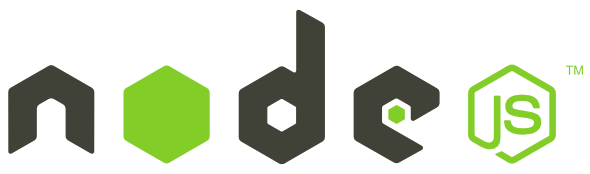

# Node.js Crash Course

  

## 📖 Chapters

1. Introduction & Setup
   - Welcome / what is Node.js?
   - What you'll learn
   - Installing Node.js
   - Running files through Node.js
1. Node.js Basics
   - node basics
   - the global object
   - modules & require
   - node & the file system
   - streams & buffers
1. Clients & Servers
   - clients & servers
   - ip addresses & domains
   - creating a server
   - localhost & port numbers
1. Requests & Responses
   - request object
   - response object
   - returning html pages
   - basic routing
   - status codes
   - redirects
1. NPM
   - 3rd party packages
   - installing packages globally (nodemon)
   - the package.json file & installing packages locally
   - dependencies & sharing code
1. Express Apps
   - what is express?
   - creating an express app
   - routing & html pages
   - redirects & 404 pages
1. View Engines
   - view engines at a glance
   - ejs view engine
   - passing data into views
   - partials
   - adding css
1. Middleware
   - what is middleware?
   - using next()
   - 3rd party middleware
   - static files
1. MongoDB
   - intro to mongodb
   - mongodb setup with atlas
   - mongoose
   - getting & saving data
   - outputting documents into views
1. Get, Post & Delete Requests
   - request types
   - post requests
   - route parameters
   - delete requests
1. Express Router & MVC
   - express router
   - mvc basics
   - controllers
1. Wrap up
